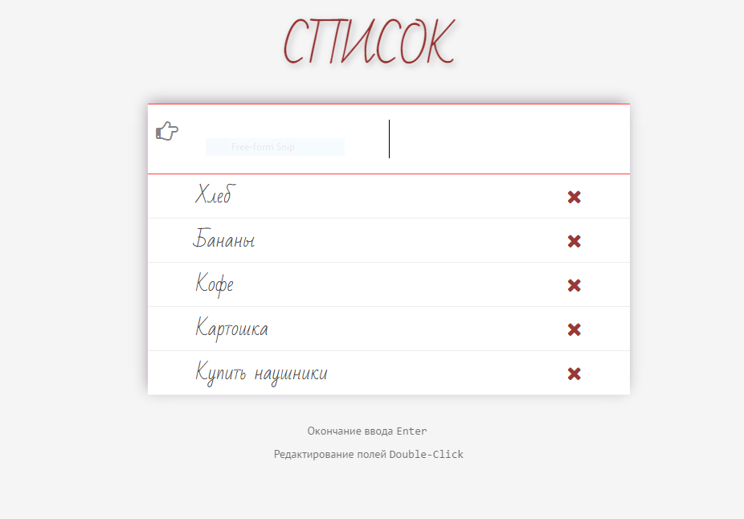

# hw_js_23_24

[-===ДЗ   ===-](https://github.com/goit-fe/markup_fe2o/tree/master/js_23-24)

Добавил возможность редактирования элемента списка.

Вынес классы Model, View, Controller в отдельные файлы. Подключил их с помощью require.js

